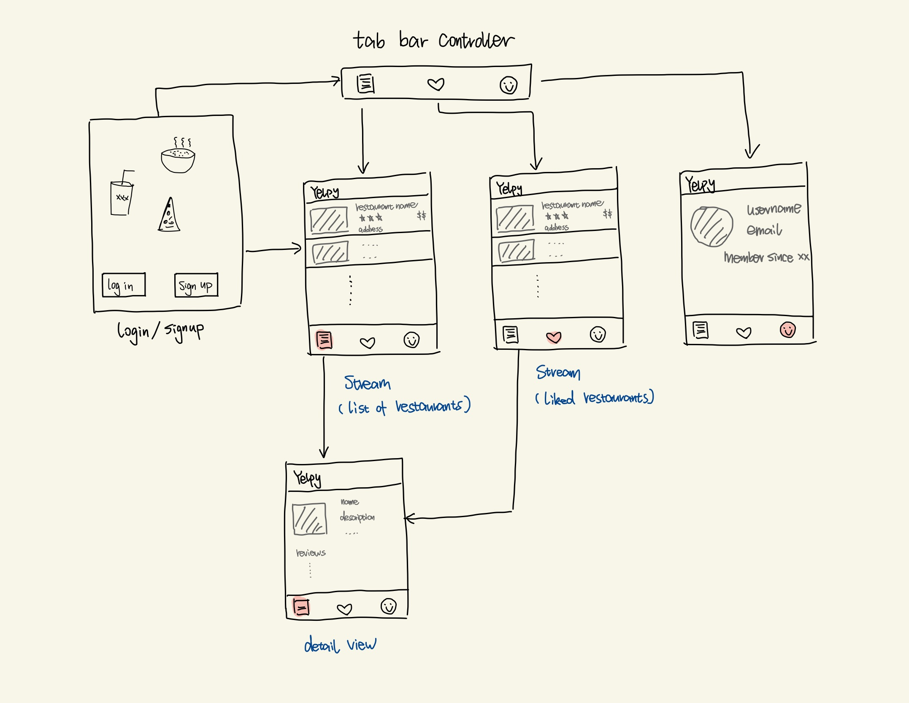

# Milestone 3 - Yelpy

## Table of Contents

1. [Overview](#Overview)
1. [Product Spec](#Product-Spec)
1. [Wireframes](#Wireframes)

## Overview
Yelp clone, allowing users to explore and learn about new restaurants

### Description
Just like Yelp our app will allow users to find entertainment around them

### App Evaluation

[Evaluation of your app across the following attributes]
- **Category:** Entertainment / Social
- **Mobile:** Easy on the go way to find new places
- **Story:** Users can create their own profile, publish their reviews to restaurants. They can also check out other people's review to explore restaurants.
- **Market:** business owners and anyone who wants to find a place to eat/have fun.
- **Habit:** Users find a place nearby when they are hungry/bored
- **Scope:** Post a listing, search, review

## Product Spec

### 1. User Features (Required and Optional)

**Required Features**

- [x] Register, login, logout
- [x] Seach nearby restaurants (ask user's location permission, and show restaurants in that area)
- [x] View restaurant detail
- [X] Filter restaurants by name, rating, etc.

**Stretch Features**

* Extending yelpy to a social media by
    - [ ] Allowing users to send direct messages to each other
    - [ ] Allowing users to publish their posts

### 2. Screen Archetypes

- Login screen
  - User can login
- Registration screen
  - User can create a new account
- Stream screen
    - User can view a feed of restaurants
- Creation screen
    - User can post a new comment or rating
- Search screen
  - User can search for restaurants
  - User can see search results
- Restaurant detail screen
  - User can see restaurant information

### 3. Navigation

**Tab Navigation** (Tab to Screen)

* Home Feed
* Search
* Liked restaurants
* Profile

**Flow Navigation** (Screen to Screen)

- Login Screen
    - => Home
- Registration Screen
    - => Home
- Stream Screen
    - => Restaurant detail screen
- Creation creen
    - => Home (after you finish posting the new review/rating)
- Search screen
    - None

## Wireframes

[Add picture of your hand sketched wireframes in this section]

## Video Walkthrough

Here's a walkthrough of implemented user stories:

GIF created with [LICEcap](https://www.cockos.com/licecap/)

